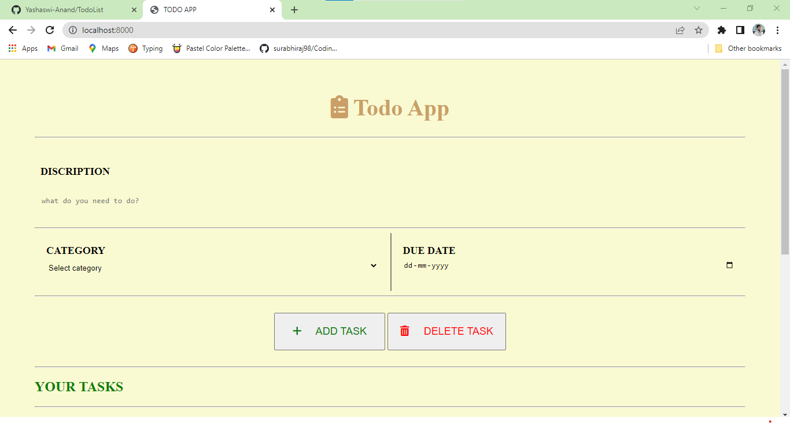
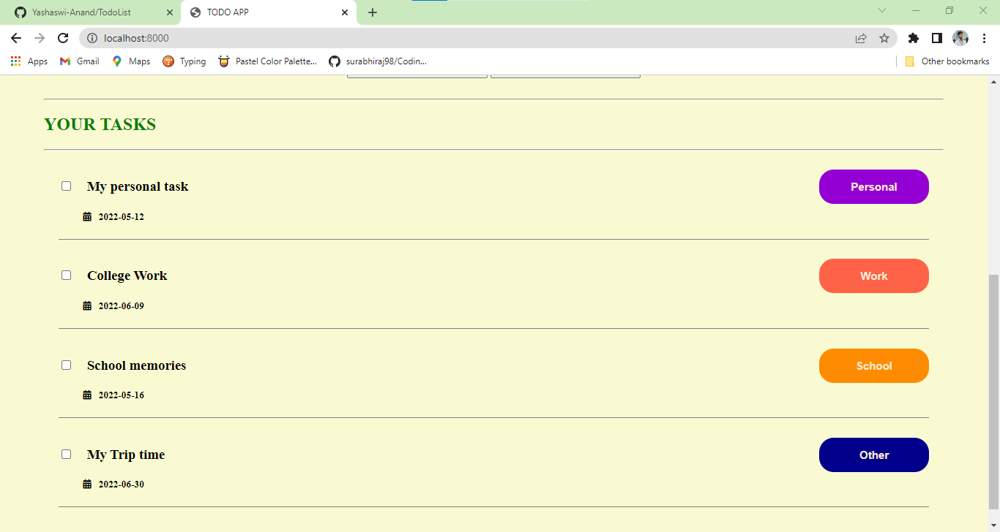
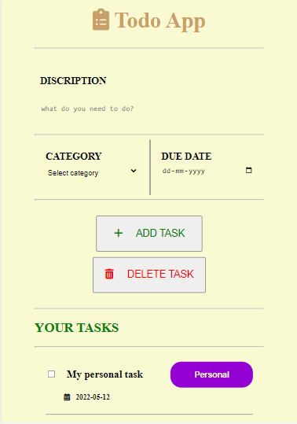

<h1> TodoList Node.js App </h1>

 
    It is sample web applicatoion using backend feature for record daily tasks/activities. 
    All the codes are written in MVC (Model-View-Controller) framework. 

<h3> Features: </h3>

<ul>
    <li>Give discription about your task.</li>
    <li>Choose your category.</li>
    <li>Choose date from calender.</li>
    <li>Add button for store data in database.</li>
    <li>List of tasks below in "Your Tasks".</li>
    <li>Check box for select for delete.</li>
    <li>Delete button for delete selected task/s.</li>
</ul>

<h3> Technology used: </h3>

<ul>
    <li>HTML</li>
    <li>CSS</li>
    <li>JavaScript</li>
    <li>Node.js</li>
    <li>Express</li>
    <li>MongoDB</li>
</ul>

<h3> ScreenShots: </h3>

    
    

<h5> Mobile View: </h5>

